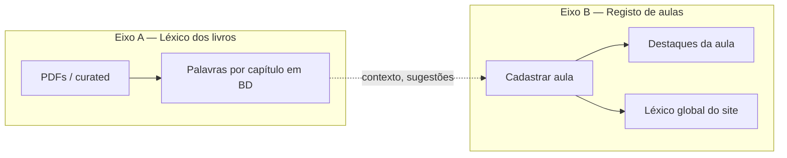

# Registo de aulas — spec e roadmap

Estado: **MVP implementado** (jul 2026). Painel do curador em `/registerClass` (cadastrar/editar) e `/reviewClass` (histórico + revisão por aula) — ver §12 Trilha B.

**Relacionado:** [11_content_db_schema.md](11_content_db_schema.md), [09_google_auth_jogo.md](09_google_auth_jogo.md), `OrganizeVocabulary_books/` (léxico dos livros — trabalho **separado**).

---

## 1. Objetivo

Formalizar o que já fazias informalmente: **registar uma aula de cada vez**, guardar as palavras que importam para ti, e gerar revisão (caderno hanzi, treino digital, …).

- Ferramenta **só para o curador** (tu). Não é pública nem colaborativa.
- **Guardar** = guardar. Sem estados draft/publicado. Editável sempre.
- O consolidado antigo (`Content/`) continua em paralelo — não é substituído aqui.

---

## 2. Dois eixos — independentes

Isto é o ponto estrutural do projeto. **Não misturar.**



| Eixo | O quê | Onde vive |
|------|-------|-----------|
| **A** | Vocabulário **canónico por capítulo** do livro (课文, 拓展, …) | `OrganizeVocabulary_books/` → BD (`book_vocab_entries`) — **seedado** via `npm run seed:content` |
| **B** | **Aula** real que tu registas (data, classe, palavras, notas) | Feature «Cadastrar aula» no site |

**Regras:**

- O **registo de aula (B) não depende** de como ou quando o léxico por capítulo (A) está na BD.
- **Capítulo ≠ aula.** Capítulo é unidade do livro; aula é sessão tua.
- **Material ref** (livro + capítulo, 0..N) é opcional na aula. Sem vínculo = válido. Aulas antigas, outras classes, sem PDF — sem caso especial.

### Para que serve o eixo A (quando existir)

- **Contexto** — sugerir pinyin, gloss, POS ao editar a tabela da aula.
- **Reconhecer** palavras que já existem no sistema (capítulo ou global).
- **Não bloquear** — se trouxeste a palavra como destaque desta aula, ela **entra na aula** na mesma.

---

## 3. Terminologia

| Termo | Significado |
|-------|-------------|
| **Aula** | Sessão real de estudo — unidade do formulário «Cadastrar aula». |
| **Capítulo** | Unidade do **livro** (PDF: 课). Nunca chamar «aula» no UI. |
| **Classe** | Turma / contexto escolar. |
| **Material ref** | Vínculo opcional: livro + capítulo(s), ou no futuro PDF. |
| **Destaque da aula** | Palavra que **tu** assinalaste nesta sessão — com contexto teu (notas, tema). |
| **Léxico global** | Pool acumulado do site — cresce ao salvar aulas. |

---

## 4. Formulário «Cadastrar aula»

| Campo | Obrigatório | Notas |
|-------|-------------|-------|
| **Data da aula** | sim | Dia da sessão (≠ data de registo). |
| **Classe** | sim | Ver §4.1 |
| **Material ref** | não | 0..N: livro + capítulo. Futuro: PDF. |
| **Lista de palavras** | sim* | Colar hanzi — ver §5 |
| **Notas gerais** | não | Texto livre |

\*Sem palavras, o registo tem pouco valor — regra de produto, não técnica.

### 4.1 Classe (lista inicial)

| ID | Etiqueta |
|----|----------|
| `confucio-b1` | Confúcio B1 |
| `confucio-b2` | Confúcio B2 |
| `prepely-chenyang` | Prepely Chenyang |
| `x-mandarin-t3` | X-Mandarin T3 |
| `x-mandarin-privado` | X-Mandarin Privado |

### 4.2 Material ref (opcional)

| Campo | Valores |
|-------|---------|
| Livro | `primary-up` (初级·上), `primary-down` (初级·下) |
| Capítulo | 1–16 |
| Repetir | (+) para mais um par livro+capítulo |

Sem ref: só lista + notas. Sem problema.

---

## 5. Lista de palavras

### Entrada (MVP)

Colar **hanzi separados por vírgulas** (ex.: saída mínima de um GPT pós-aula):

`饮食,丰富,面条,学生会,报名`

→ sistema parte por vírgulas → uma linha por palavra → **tabela editável**.

### Tabela (por palavra na aula)

| Campo | Notas |
|-------|-------|
| `hanzi` | Da colagem — **foco principal** |
| `pinyin` | Manual ou sugerido (futuro: capítulo / global) |
| `translation` | Secundário. PT preferido; **EN como fallback** se PT não existir. Pode ficar vazio. |
| `notes` | Contexto **desta aula** (dúvidas, lembretes, «名 = name») |
| `theme` | Agrupamento opcional (ex. Food, Student Union) |

**Prioridade do produto:** léxico em chinês (hanzi + pinyin). Tradução é apoio, não o centro — páginas de caderno e treino podem mostrar EN só quando faltar PT.

Protótipo de saída: `chinese_ajuda/Aula2_chinese_review_full.html`.

### Enriquecimento automático (futuro, não bloqueia MVP)

Quando o eixo A (capítulos em BD) e/ou léxico global tiverem dados:

- Sugerir pinyin / tradução se a palavra já existir.
- Material ref na aula **ajuda o contexto** da sugestão — não é obrigatório.

LLM (parse, lacunas) — fase posterior.

---

## 6. Palavras, duplicidade e contexto

**Problema real:** vais trazer palavras que **já estão** no BD (capítulo ou global). Isso é **esperado**, não erro.

**Regra:**

| Camada | Papel |
|--------|-------|
| `lesson_vocab_items` | O que **destacaste nesta aula** — sempre grava, com notas/tema **teus** para esta sessão. |
| `lexicon_global` | Pool partilhado — **upsert** ao salvar (hanzi conhecido no site). |
| `book_vocab_entries` | Referência do livro — **não substitui** o destaque da aula. |

**Se a mesma palavra aparece outra vez:**

- Noutra aula → novo `lesson_vocab_items` com contexto dessa aula.
- Já no global → global actualiza-se; **destaque da aula mantém o teu contexto** (porque desta vez importou-te na sessão).
- Em capítulo não vinculado à aula → irrelevante para o registo; podes na mesma destacá-la na aula.

**Remover palavra da aula:** sai só do destaque dessa aula. **Global não apaga** automaticamente (só edição manual no global).

---

## 7. Ao guardar

```
Cadastrar / Editar aula
    → lessons (+ material_refs)
    → lesson_vocab_items (destaques + contexto)
    → lexicon_global (upsert palavras)
```

---

## 8. Depois de guardar — por aula

| # | Feature | Descrição | Estado |
|---|---------|-----------|--------|
| 1 | **Página Hanzi** | Hanzi grandes, copiar para caderno. Em `/reviewClass/[id]` (curador). | ✅ |
| 2 | **Treino digital** | `HanziWritingGame` filtrado ao léxico **desta aula** (`useAllWords`). | ✅ |

Ambos em `web/src/app/reviewClass/[id]/page.server.tsx`. Futuro: revisão por tema, phrase-game, etc.

---

## 9. Dados (rascunho)

Ver [11_content_db_schema.md](11_content_db_schema.md).

**Eixo A (livros):** `books`, `book_vocab_entries` — import desde `OrganizeVocabulary_books/`.

**Eixo B (aulas):** `classes`, `lessons`, `lesson_material_refs`, `lesson_vocab_items`, `lexicon_global`.

---

## 10. Acesso e permissões

### 10.1 Curador — registo e edição de aulas

| Quem | O quê |
|------|-------|
| **`ianthomaz@gmail.com`** | Cadastrar aula, editar, histórico, léxico via formulário |
| Qualquer outro utilizador | **Sem acesso** a esta feature (por agora) |

**Implementação prevista:** filtro **hardcoded** por email de sessão (MVP). Sem UI de gestão de permissões.

Outros utilizadores Google no futuro → features próprias **a definir**; não partilham o formulário de aulas.

### 10.2 Login mínimo — features interactivas (site geral)

Para visitantes **não logados**, estas rotas podem ficar **desactivadas** ou pedir **login Google** antes de usar:

| Feature | Rota típica |
|---------|-------------|
| Treino de hanzi | `/randomhanzi` |
| Chat com IA (tutor) | `/tutor` |
| Jogos / quiz | `/phrase-game`, `/gamification` |

**Estado:** **implementado** via `LoginGate` (`web/src/components/AuthGate.tsx`) em `/randomhanzi`, `/tutor`, `/phrase-game`, `/gamification`. Convidado vê cartão de login (One Tap + Google). O `/api/chat` (tutor) também exige sessão no servidor. No export estático (`NEXT_PUBLIC_AUTH_ENABLED=0`) mostra aviso «funcionalidade desativada».

**Conteúdo estático** (revisão, vocabulário, gramática, diálogos do consolidado) — **sem** exigir login, salvo decisão futura.

### 10.3 Páginas de revisão por aula (caderno)

- URL privada (fora do nav).
- Acesso: **a definir** (curador só, ou link partilhável). Por defeito alinhado ao curador.

---

## 11. Decisões

| Tópico | Estado |
|--------|--------|
| Colagem | Hanzi por vírgulas |
| Material ref | Opcional; 0..N |
| Capítulo vs aula | Termos distintos; eixos independentes |
| Duplicidade | Destaque da aula sempre; global upsert; sem apagar global ao remover da aula |
| Revisão por aula | URL privada |
| Tradução | Foco hanzi + pinyin; PT se houver, senão EN; vazio OK |
| Curador (aulas) | **Decidido + implementado:** `ianthomaz@gmail.com` via `isAdminEmail` |
| Login em features interactivas | **Implementado:** treino hanzi, tutor, jogos/quiz com gate bloqueante (`LoginGate`); export estático mostra aviso «desativado» |
| Chave do global | **Decidido:** hanzi **exacto** (sem normalização) |

---

## 12. Roadmap

Dois trabalhos **em paralelo**. Nenhum bloqueia o outro.

### Trilha A — Léxico por capítulo (repo + BD)

- [x] Curadoria `OrganizeVocabulary_books/curated/`
- [x] Import → `book_vocab_entries` (`npm run seed:content`)
- [x] Sugestões no formulário de aula (`/api/book-vocab/suggest`)
- [ ] (Opcional) UI consulta capítulo

### Trilha B — Registo de aulas (site)

- [x] OAuth + `users` (fundação)
- [x] Gate curador: `ianthomaz@gmail.com` (via `isAdminEmail`) — páginas `.server.tsx` + API `requireCurator`
- [x] Formulário + tabela + guardar → `lessons`/`lesson_material_refs`/`lesson_vocab_items` + upsert `lexicon_global`
- [x] Histórico de aulas (`/reviewClass`)
- [x] Página Hanzi da aula (`/reviewClass/[id]` — hanzi grandes para caderno)
- [x] Treino hanzi da aula (`HanziWritingGame` com `useAllWords`)
- [x] Sugestões a partir de capítulo/global (quando A existir)
- [ ] LLM no pipeline

### Trilha C — Login em features interactivas (site geral)

- [x] Treino hanzi — `LoginGate` (login obrigatório; convidado vê cartão de login)
- [x] Tutor / chat IA — `LoginGate` + `/api/chat` exige sessão (+ rate-limit)
- [x] Jogos e quiz — `LoginGate` em `/phrase-game` e `/gamification`
- [ ] Outros utilizadores logados — política de features **a definir depois**

---

## 13. Fora de scope

- Registo de aulas para outros utilizadores (só `ianthomaz@gmail.com` no MVP)
- Política completa de features para “outros users” logados
- Substituir consolidado
- Aulas históricas em massa
- Deploy remoto sem ordem explícita

*Última revisão: jul 2026*
